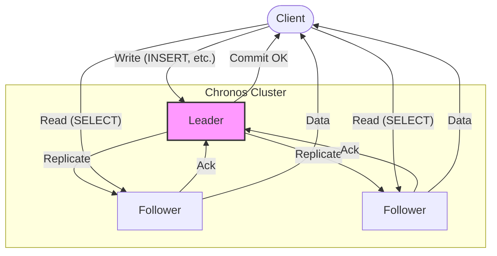

# Chronos: A Distributed SQL Database in Rust

[](https://github.com/0xReLogic/chronos/actions/workflows/rust.yml)
[](https://opensource.org/licenses/MIT)

**Chronos is not just another database; it's a journey into the heart of distributed systems, built from the ground up in Rust.** It leverages the power of the Raft consensus algorithm to create a fault-tolerant, consistent SQL database that can withstand node failures without losing data.

This project was born from a desire to deeply understand and implement the complex mechanics behind modern distributed databases.

---

## Architecture Overview

Chronos operates as a cluster of nodes, with one leader and multiple followers. All write operations are routed through the Raft consensus module, ensuring that every change is safely replicated across a majority of nodes before being committed.



---

## Key Features

- **Distributed Consensus with Raft:** Guarantees data consistency and availability through a robust, from-scratch implementation of the Raft algorithm.
- **SQL Interface:** Interact with your distributed data using familiar SQL commands (`CREATE TABLE`, `INSERT`, `SELECT`, `UPDATE`, `DELETE`).
- **Fault Tolerance:** The cluster can survive the failure of minority nodes and continue operating, with a new leader elected automatically.
- **Persistent Storage:** Data is persisted to disk using Sled embedded database, ensuring durability and fast performance.
- **Async I/O:** Fully asynchronous storage operations with Tokio runtime for efficient concurrent access.
- **Built in Rust:** Leverages Rust's performance, safety, and concurrency features to build a reliable system.

---

## Quick Start

Get a Chronos cluster up and running in minutes.

### 1. Prerequisites

- Rust toolchain (latest stable)
- `protoc` (Protocol Buffers compiler)

### 2. Clone & Build

```bash
# Clone the repository
git clone https://github.com/0xReLogic/Chronos.git
cd Chronos

# Build the project
cargo build --release
```

### 3. Run the Cluster

Open three separate terminals.

**Terminal 1 (Node 1 - Leader):**
```bash
cargo run --release -- server --id 1 --port 8080 --raft-port 9090 --peers 2:localhost:9091 3:localhost:9092
```

**Terminal 2 (Node 2 - Follower):**
```bash
cargo run --release -- server --id 2 --port 8081 --raft-port 9091 --peers 1:localhost:9090 3:localhost:9092
```

**Terminal 3 (Node 3 - Follower):**
```bash
cargo run --release -- server --id 3 --port 8082 --raft-port 9092 --peers 1:localhost:9090 2:localhost:9091
```

### 4. Connect with the Client

Open a fourth terminal.

```bash
cargo run --release -- client --port 8080
```

### 5. Execute SQL

Now you can interact with your distributed database!

```sql
chronos> CREATE TABLE users (id INT, name STRING, balance FLOAT);
Query OK

chronos> INSERT INTO users (id, name, balance) VALUES (1, 'Alice', 100.50);
Query OK

chronos> INSERT INTO users (id, name, balance) VALUES (2, 'Bob', 250.75);
Query OK

chronos> SELECT id, name, balance FROM users;
+----+-------+---------+
| id | name  | balance |
+----+-------+---------+
| 1  | Alice | 100.5   |
| 2  | Bob   | 250.75  |
+----+-------+---------+

-- Delete a record
DELETE FROM users WHERE name = 'Bob';

-- Use a transaction
BEGIN;
INSERT INTO users (id, name, age) VALUES (3, 'Charlie', 40);
COMMIT;
```

## Performance Benchmarks

Tested on Ubuntu 24.04.3 LTS with Sled storage engine (size-optimized build):

**Binary Size:**
- Optimized release build: **3.7MB** (down from 12MB)
- Suitable for edge devices and embedded systems

**Insert Performance:**
- 100 rows: ~2.2ms (median)
- 1,000 rows: ~7.9ms (median)
- **Throughput: 126,000 rows/second** (batch inserts)

**Query Performance (Full Scan):**
- 100 rows: ~2.2ms
- 1,000 rows: ~9.4ms
- Linear scaling with low variance

Run benchmarks yourself:
```bash
cargo bench
```

Try the IoT sensor demo:
```bash
cargo run --example storage_demo
```

## Development Status

Chronos is a learning project and is not intended for production use. It currently implements:

- SQL parsing with Pest and execution (CREATE, INSERT, SELECT, UPDATE, DELETE, CREATE INDEX)
- Sled embedded database for persistent storage with async I/O
- Raft consensus algorithm for leader election and log replication
- gRPC-based networking for node communication with Protocol Buffers
- Async/await architecture with Tokio runtime

## Edge/IoT Roadmap

Target: Transform Chronos into production-ready edge database for IoT deployments.

**Priority 1 - Critical (Next 1-2 hours):**
- [x] Binary size optimization: 12MB → 3.7MB (opt-level=z, LTO, strip symbols) 
- [ ] Integration tests for distributed scenarios
- [ ] Node restart persistence validation

**Priority 2 - High Impact (Next 1-2 days):**
- [ ] Time-series storage optimization
  - Columnar storage per device_id
  - Timestamp-based partitioning (hourly/daily buckets)
  - Downsampling strategy (raw → 1min avg → 1hr avg)
  - TTL for auto-cleanup with configurable retention
  - Expected: 10x storage reduction, 5x faster queries
  
- [ ] Offline-first mode
  - Local write buffer when leader unreachable
  - Ring buffer + WAL for durability
  - Auto-sync on reconnection with batching
  - Vector clocks for conflict detection
  - Expected: 99.9% write availability even with network issues

**Priority 3 - Medium Term (Next week):**
- [ ] Network optimization for unreliable connections
  - Message batching (aggregate multiple writes)
  - Payload compression (zstd/lz4)
  - Adaptive Raft config (tune heartbeat based on network quality)
  - Expected: 50% bandwidth reduction
  
- [ ] Monitoring & observability
  - Metrics: write_latency, query_latency, storage_size, memory_usage
  - Health checks: /health endpoint
  - Alerts: disk_full, high_latency, leader_election_failed

**Long-term (Future):**
- [ ] More comprehensive SQL support (JOINs, aggregations, subqueries)
- [ ] CRDT-based conflict resolution
- [ ] Edge-to-cloud sync protocol
- [ ] Security (at-rest encryption, mTLS)
- [ ] OTA update mechanism

## Technical Notes

**Storage Engine Migration (Dec 2025):**
- Migrated from CSV to Sled embedded database
- Full async/await refactor with Tokio runtime
- Changed std::sync::Mutex → tokio::sync::Mutex throughout
- Bincode v2.0 for efficient serialization

**Key Architecture Decisions:**
- Sled over RocksDB: Pure Rust, smaller binary footprint (~100KB vs multi-MB)
- Async-native: Prevents blocking, prepares for high-concurrency workloads
- Trait abstraction: Easy to swap storage backends (RocksDB, custom LSM tree)

**Known Limitations:**
- Binary size 12MB (optimization pending)
- No time-series specific optimizations yet
- Raft heartbeat 50ms (aggressive for IoT networks)
- No snapshot/log compaction mechanism
- Single-threaded executor (no parallel queries)

## License

This project is licensed under the MIT License - see the LICENSE.md file for details.
