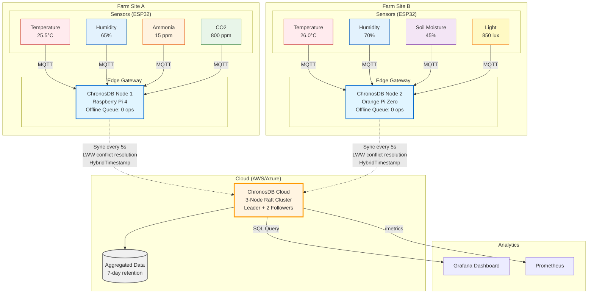

# ChronosDB

[](https://github.com/0xReLogic/chronos/actions/workflows/rust.yml)
[](https://opensource.org/licenses/MIT)
[](https://www.rust-lang.org)
[](https://github.com/0xReLogic/Chronos)
[](https://github.com/0xReLogic/Chronos)
[](https://github.com/0xReLogic/Chronos)

**Production-grade distributed SQL database engineered from the ground up in Rust. Purpose-built for edge computing, IoT gateways, and resource-constrained environments with intermittent connectivity.**

## Architecture



**Key Capabilities:**
- **Edge Autonomy:** Each gateway operates independently with local SQL storage
- **Offline Resilience:** Persistent queue buffers operations during network outages
- **Conflict-Free Sync:** HybridTimestamp-based LWW ensures deterministic conflict resolution
- **Real-Time Analytics:** 1h/24h/7d aggregations computed at edge, synced to cloud

## Key Features

- **Custom Raft Consensus:** From-scratch implementation with pre-vote extension, lease-based reads, and log compaction for sub-5ms query latency
- **Hybrid Logical Clocks (HLC):** UHLC-based distributed timestamp ordering with causal consistency guarantees for conflict-free edge-to-cloud replication
- **Bit-Level Compression:** Experimental Chimp algorithm with XOR encoding and leading-zero optimization for time-series FLOAT columns (2-3x better than LZ4)
- **Pluggable Storage Trait:** Abstract storage interface with Sled backend, transparent LZ4 row compression, secondary B-tree indexes, and adaptive LRU caching
- **Offline-First Replication:** Persistent operation queue with HybridTimestamp metadata, automatic sync worker, LWW conflict resolution, and per-edge cursor tracking
- **Real-Time Aggregation Engine:** Lock-free in-memory hierarchical buckets (minute/hour/day) for streaming 1h/24h/7d windowed analytics without full table scans
- **Connectivity-Aware Sync:** Automatic network state detection (Connected/Disconnected/Reconnecting) with exponential backoff and health probe integration
- **Zero-Copy Serialization:** Protocol Buffers + bincode with minimal allocation overhead for high-throughput edge workloads
- **Production Observability:** Prometheus metrics export, structured tracing, rotating file logs, and gRPC health endpoints
- **Defense-in-Depth Security:** Bearer token RBAC with role separation, mTLS certificate validation, per-operation audit logging, and TLS domain verification

## Quick Start

### Installation

**Download pre-built binary:**
```bash
wget https://github.com/0xReLogic/Chronos/releases/latest/download/chronos-linux-x86_64
chmod +x chronos-linux-x86_64
sudo mv chronos-linux-x86_64 /usr/local/bin/chronos
```

**Or build from source:**
```bash
cargo build --release
# Binary: target/release/chronos (5.6MB)
```

### Single-Node Mode

```bash
chronos single-node --data-dir data
```

### 3-Node Cluster

```bash
# Terminal 1
./chronos node --id node1 --address 127.0.0.1:8000 \
  --peers node2=127.0.0.1:8001,node3=127.0.0.1:8002

# Terminal 2
./chronos node --id node2 --address 127.0.0.1:8001 \
  --peers node1=127.0.0.1:8000,node3=127.0.0.1:8002

# Terminal 3
./chronos node --id node3 --address 127.0.0.1:8002 \
  --peers node1=127.0.0.1:8000,node2=127.0.0.1:8001

# Client
./chronos client --leader 127.0.0.1:8000
```

### Edge-to-Cloud Sync

```bash
# Cloud node
./chronos node --id cloud --address 10.0.0.10:8000

# Edge node (syncs to cloud)
./chronos node --id edge1 --address 192.168.1.100:8001 \
  --sync-target http://10.0.0.10:8000 \
  --sync-interval-secs 5
```

## SQL Examples

```sql
-- Create table with TTL
CREATE TABLE sensors (id INT, temp FLOAT, device STRING) WITH TTL=7d;

-- Create index
CREATE INDEX idx_device ON sensors(device);

-- Insert data
INSERT INTO sensors VALUES (1, 25.5, 'sensor-01');

-- Query
SELECT * FROM sensors WHERE device = 'sensor-01';

-- Time-window aggregations
SELECT AVG_1H(temp) FROM sensors;
SELECT AVG_24H(temp) FROM sensors;
SELECT AVG_7D(temp) FROM sensors;
```

## Performance

**Binary:** 5.6MB (optimized)

**Throughput:**
- Single-node: ~28k rows/sec (1000-row batch)
- 3-node Raft: ~1.8k writes/sec
- IoT batches (10 rows): ~12.6k rows/sec

**Latency:**
- Full scan (1000 rows): ~9ms
- Indexed query: <5ms
- Leader-local read: ~2ms

**Resources:**
- RAM: ~50MB idle, ~110MB under load
- CPU: ~75% of one core at 1.8k writes/sec

## Documentation

Comprehensive documentation in `docs/`:

- [Architecture](docs/architecture.md) - System design, components, data flow
- [Deployment Guide](docs/deployment-guide.md) - Production deployment, operations
- [SQL Reference](docs/sql-reference.md) - Complete SQL syntax and examples
- [API Reference](docs/api-reference.md) - gRPC, HTTP, embedded mode APIs

## Configuration

### Environment Variables

```bash
# Logging
export RUST_LOG=chronos=info
export CHRONOS_LOG_FILE=chronos.log

# Authentication
export CHRONOS_AUTH_TOKEN_ADMIN=your-admin-token
export CHRONOS_AUTH_TOKEN_READONLY=your-readonly-token

# TLS/mTLS
export CHRONOS_TLS_CERT=/path/to/server.crt
export CHRONOS_TLS_KEY=/path/to/server.key
export CHRONOS_TLS_CA_CERT=/path/to/ca.crt

# Experimental: Chimp compression
export CHRONOS_CHIMP_ENABLE=1
```

## Operations

### Health Check

```bash
curl http://127.0.0.1:9000/health
# {"status":"ok","role":"Leader","term":5}
```

### Metrics

```bash
curl http://127.0.0.1:9000/metrics
# Prometheus-compatible metrics
```

### Backup

```bash
./chronos snapshot create --data-dir ./data --output backup.snap
./chronos snapshot restore --data-dir ./data --input backup.snap --force
```

## Testing

```bash
# Full test suite
cargo test

# Raft cluster tests
cargo test --test raft_cluster

# Property-based tests
cargo test --test raft_log_proptest

# Benchmarks
cargo bench
```

## License

MIT License - see LICENSE.md for details.
