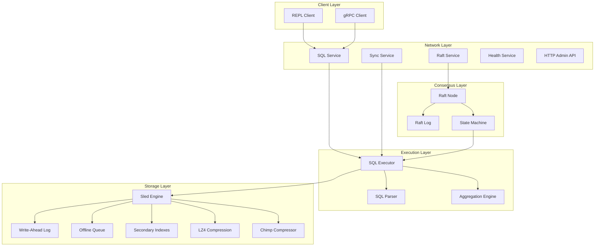
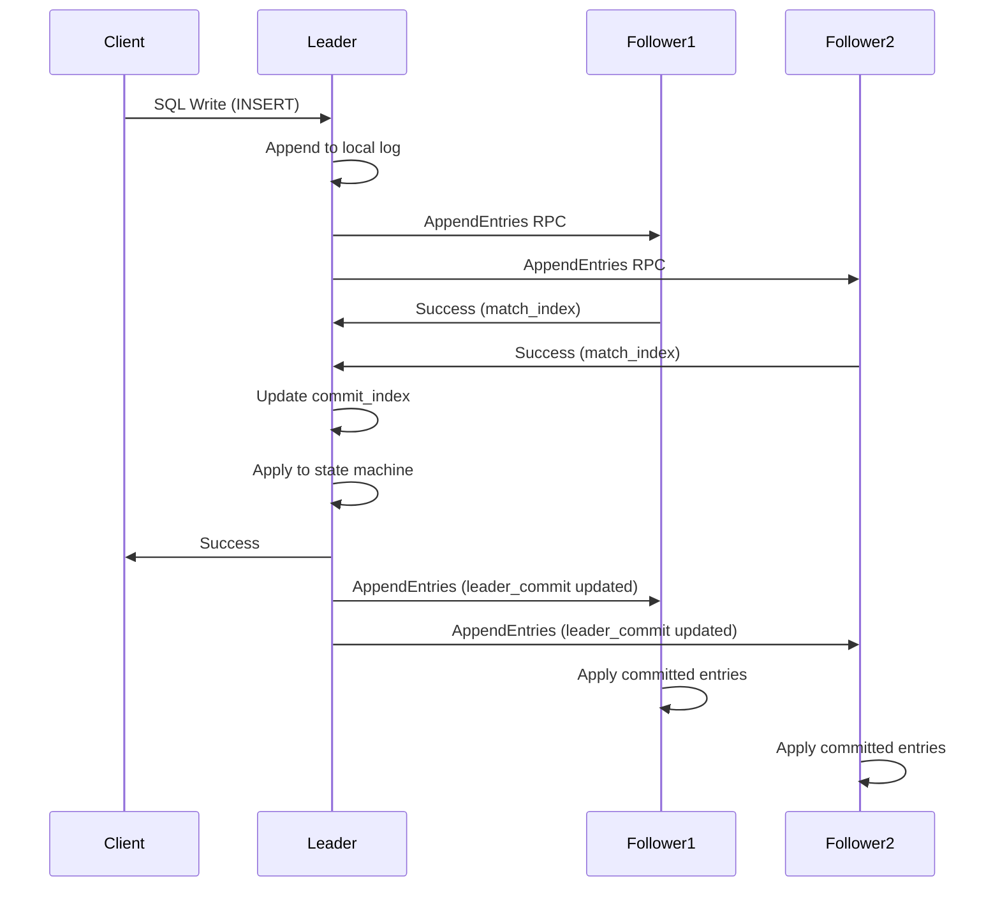
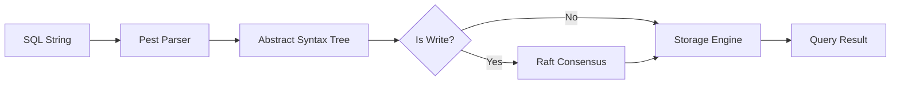
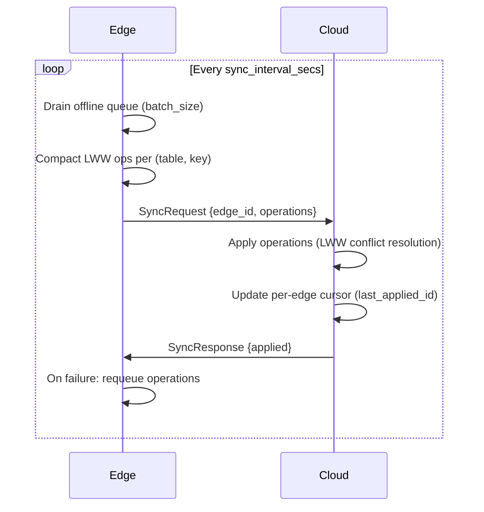
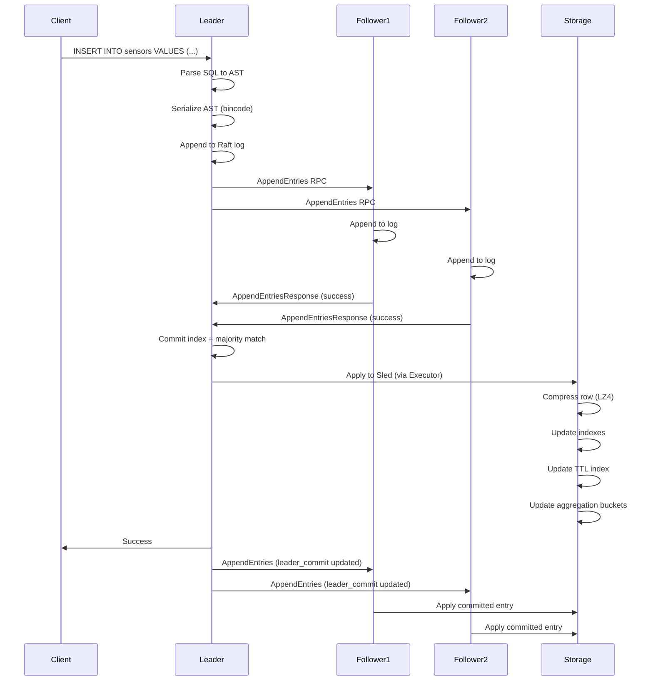
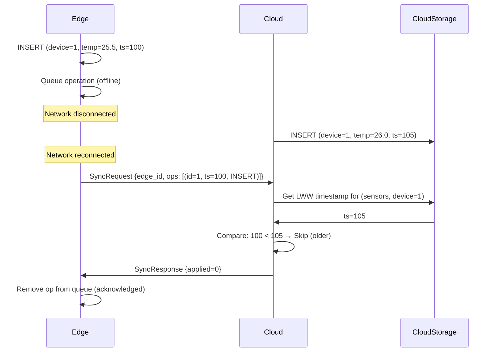

# ChronosDB Architecture

## Document Purpose

Comprehensive technical architecture documentation for ChronosDB, covering distributed consensus, storage engine internals, network topology, and data flow patterns.

---

## System Overview

ChronosDB is a distributed SQL database built from scratch in Rust, designed for edge computing and IoT workloads. The system prioritizes:

- Small binary footprint (5.6MB optimized build)
- Offline-first operation with eventual consistency
- Resource efficiency for constrained devices
- Strong consistency via Raft consensus
- Edge-to-cloud synchronization with conflict resolution

**Target Deployment:** Edge gateways, industrial IoT devices, farm/factory sensors with intermittent connectivity.

---

## Architecture

ChronosDB follows a layered architecture with clear separation of concerns:



---

## Core Components Explained

### 1. Network Layer

#### gRPC Services

**Location:** `src/network/server.rs`, `proto/raft.proto`

ChronosDB exposes four primary gRPC services:

**RaftService**
- `RequestVote`: Leader election voting
- `PreVote`: Pre-election phase to reduce disruption
- `AppendEntries`: Log replication and heartbeats

**SqlService**
- `ExecuteSql`: Execute SQL statements (CREATE, INSERT, SELECT, UPDATE, DELETE)
- Authentication: Bearer token validation (admin vs read-only)
- Authorization: Role-based access control

**SyncService**
- `Sync`: Edge-to-cloud delta synchronization
- Accepts batches of operations with HybridTimestamp metadata
- Returns number of applied operations
- Authentication: Bearer token validation (admin)

**HealthService**
- `GetConnectivity`: Returns node connectivity state
- Used for load balancer health checks

**SyncStatusService**
- `GetSyncStatus`: Returns sync metrics (last sync time, pending ops, errors)

#### HTTP Admin API

**Location:** `src/network/http_admin.rs`

Lightweight HTTP server on `grpc_port + 1000`:

- `/health`: JSON health status `{status, role, term}`
- `/metrics`: Prometheus-compatible metrics
  - `chronos_sql_requests_total{kind="read|write"}`
  - `chronos_raft_term`
  - `chronos_raft_role` (0=follower, 1=candidate, 2=leader)
  - `chronos_storage_size_bytes`
 - `/ingest`: Optional gateway ingest endpoint (when node is started with `--enable-ingest`) that accepts JSON payloads from ESP/IoT devices, enqueues them in memory, and writes into the `readings` table via the SQL executor.

Authentication (when `CHRONOS_AUTH_TOKEN_ADMIN`/`CHRONOS_AUTH_TOKEN_READONLY` is set): `/health` + `/metrics` allow admin/read-only token, `/ingest` requires admin token.

---

### 2. Consensus Layer (Raft)

**Location:** `src/raft/`

#### Raft Implementation

ChronosDB implements Raft consensus from scratch with the following components:

**RaftNode** (`src/raft/node.rs`)
- State machine: Follower, Candidate, Leader
- Term management and vote tracking
- Election timeout with randomization (800-1600ms default, tuned for small edge nodes)
- Heartbeat interval (100ms default)
- Lease-based reads (3x heartbeat interval)

**RaftLog** (`src/raft/log.rs`)
- Persistent log entries stored in `raft/log.bin`
- Format: `bincode(Vec<LogEntry { term: u64, command: bytes }>)`
- Implementation rewrites the log file on append/truncate (simple, not streaming append-only)
- In-memory cache for log entries

**Pre-Vote Extension**
- Prevents disruptive elections when partitioned nodes rejoin
- Candidate sends PreVote RPC before incrementing term
- Only starts real election if majority grants pre-vote

**Lease-Based Reads**
- Leader maintains short lease (default 3x heartbeat; with 100ms heartbeat default = 300ms)
- Read queries served on the leader without quorum; lease tracked via `RaftNode::can_serve_read_locally()`
- Reduces read latency from ~5ms to ~2ms

#### Log Replication Flow



#### State Machine Replication

**Location:** `src/main.rs` (apply worker), `src/executor/mod.rs`

- Leader serializes SQL AST as Raft log command (bincode)
- Followers apply committed log entries via `Executor::apply_command`
- Idempotent apply: CREATE TABLE checks if table exists
- Ensures all nodes converge to same state

---

### 3. Execution Layer

**Location:** `src/executor/mod.rs`

#### SQL Executor

The executor is the core query processing engine:

**Responsibilities:**
- Parse SQL via Pest grammar (`src/parser/chronos.pest`)
- Validate table schemas
- Execute CRUD operations
- Manage transactions (BEGIN/COMMIT/ROLLBACK)
- Coordinate with Raft for distributed writes
- Maintain time-window aggregations

**Query Path:**



**Write Path (Distributed Mode):**
1. Client sends SQL to leader
2. Executor checks `is_leader()`
3. Serialize AST to bincode
4. Submit to Raft via `RaftNode::submit_command`
5. Wait for commit + apply via oneshot channel
6. Return success to client

**Read Path:**
1. Check if leader (or lease valid)
2. Query storage engine directly
3. Apply filters and projections
4. Return rows to client

#### Time-Window Aggregations

**Location:** `src/executor/mod.rs` (lines 20-201)

ChronosDB maintains in-memory hierarchical buckets for fast time-series aggregations:

**Bucket Structure:**
- 1-hour window: 60 one-minute buckets
- 24-hour window: 24 one-hour buckets
- 7-day window: 7 one-day buckets

**Update Flow:**
- On INSERT, extract FLOAT columns
- Update corresponding buckets (minute, hour, day)
- Persist bucket snapshots to Sled tree `__agg_state__`

**Query Flow:**
- `SELECT AVG_1H(temperature) FROM sensors`
- Scan last 60 minute buckets
- Sum values and counts
- Return average

**Persistence:**
- Aggregation state stored in dedicated Sled tree
- Loaded on executor startup
- Survives node restarts

---

### 4. Storage Layer

**Location:** `src/storage/`

#### Sled Embedded Database

**Why Sled:**
- Pure Rust, async-compatible
- Embedded (no separate process)
- ACID transactions
- Small binary footprint
- Good performance for edge workloads

**Tree Structure:**

```
data/
├── __schemas__          # Table metadata (TableSchema)
├── __indexes__          # Index metadata
├── __ttl__              # TTL expiry index (timestamp -> table -> row_key)
├── __lww_ts__           # Last-Write-Wins timestamps
├── __offline_queue__    # Persistent offline operations
├── __wal__              # Write-ahead log entries
├── __agg_state__        # Time-window aggregation buckets
├── table:{name}         # Row data (key -> compressed row)
└── index:{table}:{col}  # Secondary indexes (value -> row_key)
```

#### Row Storage

**Format:**
- Key: Row key string (`<insert_time_nanos>:<rand_hex>`) for stable uniqueness and time locality
- Value: LZ4-compressed bincode-encoded Row
- Compression: Transparent, ~7x reduction for typical IoT data

**Row Structure:**
```rust
struct Row {
    values: HashMap<String, Value>
}

enum Value {
    Integer(i64),
    Float(f64),
    String(String),
    Boolean(bool),
    Null,
}
```

#### Secondary Indexes

**Location:** `src/storage/sled_engine.rs`

**Index Creation:**
```sql
CREATE INDEX idx_device ON sensors(device_id);
```

**Index Tree:**
- Tree name: `index:sensors:device_id`
- Key: `json(value):row_key` (prefix-scan by `json(value)`)
- Value: `row_key`

**Query Optimization:**
- `WHERE device_id = 5` uses index scan
- Full table scan fallback if no index

**Index Maintenance:**
- INSERT: Add index entry
- DELETE: Remove index entry
- UPDATE: Delete old + insert new

#### LRU Row Cache

**Location:** `src/storage/sled_engine.rs`

- In-memory LRU cache (default: 10,000 entries)
- Key: `(table_name, row_key)`
- Value: Decompressed Row
- Used on indexed query path
- Cache hit rate: >80% for recent data

---

### 5. Offline-First & Sync

#### Offline Queue

**Location:** `src/storage/offline_queue.rs`

**Purpose:** Persist write operations when edge node is disconnected from cloud.

**Queue Entry:**
```rust
struct PersistentQueuedOperation {
    id: u64,                    // Monotonic sequence ID
    timestamp: HybridTimestamp, // Hybrid logical clock timestamp
    operation: Operation,       // INSERT/UPDATE/DELETE
}
```

**Storage:**
- Sled tree: `__offline_queue__`
- Key: `id` (u64, big-endian)
- Value: bincode-encoded operation

**Drain Flow:**
1. SyncWorker calls `Executor::drain_offline_queue(limit)`
2. Drain removes oldest `limit` operations
3. Compact LWW ops per `(table, key)` before sending
4. Send to cloud via `SyncService::Sync`
5. On failure: requeue compacted operations

#### Edge-to-Cloud Sync

**Location:** `src/network/sync_worker.rs`, `src/network/server.rs`

**Sync Protocol:**



**Conflict Resolution (Last-Write-Wins):**

**Location:** `src/network/server.rs` (SyncServer)

1. Extract `(table, key, HybridTimestamp)` from operation
2. Fetch stored timestamp from `__lww_ts__` tree
3. Compare: `incoming_ts > stored_ts`?
   - Yes: Apply operation, update stored timestamp
   - No: Skip operation (older write)

**Per-Edge Cursor:**
- Cloud tracks `last_applied_id` per `edge_id`
- Skips operations with `id <= last_applied_id`
- Prevents duplicate application after reconnect

**HybridTimestamp:**
```rust
struct HybridTimestamp {
    ts: uhlc::Timestamp,
    node_id: u64,
}
```

- Combines logical causality + physical time
- Total order for conflict resolution
- Survives clock skew

---

### 6. Data Retention (TTL)

**Location:** `src/storage/sled_engine.rs`, `src/main.rs`

**Per-Table TTL:**
```sql
CREATE TABLE sensors (id INT, temp FLOAT) WITH TTL=7d;
```

**TTL Index:**
- Tree: `__ttl__`
- Key: `expiry_timestamp:table_name:row_key`
- Value: empty

**Cleanup Worker:**
- Runs every `ttl_cleanup_interval_secs` (default: 3600s)
- Scans TTL index for expired rows
- Deletes up to `limit` rows per pass (default: 1000)
- Updates secondary indexes and cache

**Expiry Calculation:**
```
expiry_time = insert_time + ttl_seconds
expired = current_time > expiry_time
```

---

### 7. Compression

#### Row-Level LZ4

**Location:** `src/storage/sled_engine.rs`

- Transparent compression on write
- Decompression on read
- ~7x reduction for typical IoT data
- Fast: <1ms per 1000 rows

#### Chimp Time-Series Compression (Experimental)

**Location:** `src/storage/compression/chimp.rs`

**Enabled via:** `CHRONOS_CHIMP_ENABLE=1`

**Algorithm:**
- XOR-based encoding for FLOAT columns
- Leading/trailing zero optimization
- Streaming decode (no full decompression)
- 2-3x better than LZ4 for time-series

**Storage:**
- Parallel structure to row storage
- Tree: `series:chimp:{table}:{column}`
- Metadata: `__series_meta__` (next ID)

**Use Case:** High-frequency sensor data with limited storage.

---

## Data Flow / Sequence of Operations

### Write Operation (3-Node Cluster)



### Edge-to-Cloud Sync with Conflict



---

## API or Data Model

### SQL Surface Area

**Supported Statements:**

```sql
-- DDL
CREATE TABLE sensors (id INT, temp FLOAT, device STRING) WITH TTL=7d;
CREATE INDEX idx_device ON sensors(device);

-- DML
INSERT INTO sensors (id, temp, device) VALUES (1, 25.5, 'sensor-01');
SELECT id, temp FROM sensors WHERE device = 'sensor-01';
UPDATE sensors SET temp = 26.0 WHERE id = 1;
DELETE FROM sensors WHERE id = 1;

-- Time-Window Aggregations
SELECT AVG_1H(temp) FROM sensors;
SELECT AVG_24H(temp) FROM sensors;
SELECT AVG_7D(temp) FROM sensors;

-- Transactions (single-node only)
BEGIN;
INSERT INTO sensors VALUES (2, 30.0, 'sensor-02');
COMMIT;
```

**Limitations:**
- JOIN only supported for `SELECT ... FROM left JOIN right USING (column)`
- No subqueries or window functions
- GROUP BY only supported for `SELECT col, COUNT(*) FROM table [WHERE ...] GROUP BY col` (no HAVING)
- Single-row ACID only (no multi-row transactions in distributed mode)
- Aggregations support COUNT/SUM/AVG/MIN/MAX (no GROUP BY except COUNT(*))
- Time-window aggregations limited to AVG_1H/24H/7D for FLOAT columns (no WHERE)

### gRPC Protocol

**SQL Request:**
```protobuf
message SqlRequest {
  string sql = 1;
}

message SqlResponse {
  bool success = 1;
  string error = 2;
  repeated string columns = 3;
  repeated Row rows = 4;
}
```

**Sync Request:**
```protobuf
message SyncRequest {
  string edge_id = 1;
  repeated SyncOperation operations = 2;
}

message SyncOperation {
  uint64 id = 1;
  bytes data = 2;  // bincode(PersistentQueuedOperation)
}
```

---

## Technical Considerations

### Performance Characteristics

**Binary Size:** 5.6MB (optimized with LTO, strip, opt-level=z)

**Write Throughput:**
- Single-node: ~28k rows/sec (1000-row batch)
- 3-node Raft: ~1.8k writes/sec (full replication)
- IoT small batches (10 rows): ~12.6k rows/sec

**Read Latency:**
- Full scan (1000 rows): ~9ms
- Indexed query: <5ms
- Leader-local read (lease): ~2ms

**Resource Usage:**
- RAM: ~50MB idle, ~110MB under load (leader)
- CPU: ~75% of one core at 1.8k writes/sec
- Disk: ~100MB for 1M sensor readings (compressed)

### Trade-offs

**Raft vs Single-Node:**
- Raft adds ~5% write latency overhead
- Provides fault tolerance (survives minority failures)
- Requires 3+ nodes for high availability

**LWW Conflict Resolution:**
- Simple and deterministic
- Provides eventual consistency for edge scenarios

**In-Memory Aggregations:**
- Fast queries (<10ms for 1-hour window)
- Limited to pre-defined windows (1h/24h/7d)
- No arbitrary time ranges or GROUP BY

**Sled Storage:**
- Good balance of performance and simplicity
- Embedded design optimized for edge devices

### Failure Modes

**Leader Failure:**
- Election timeout triggers new election (800-1600ms default)
- New leader elected via majority vote
- MTTR: <60s for single-node failure

**Network Partition:**
- Minority partition cannot accept writes
- Majority partition continues operating
- Partition heals: minority syncs from leader

**Edge Disconnection:**
- Writes queued locally (persistent offline queue; bounded by disk)
- Automatic sync on reconnect
- LWW resolves conflicts

**Disk Full:**
- Writes fail with storage error
- TTL cleanup frees space
- Operator must monitor disk usage

---

---

This architecture is designed for small-scale edge deployments (1-10 nodes per site) with hundreds to thousands of sensors. For larger deployments, consider sharding or multi-region topologies.
